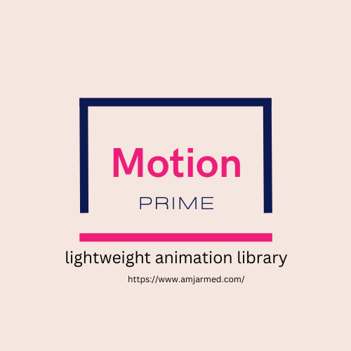

# MotionPrime

[](https://www.amjarmed.com/)

**MotionPrime** is a lightweight animation library offering 14 essential animations for modern web development. Designed for simplicity and flexibility, it allows you to enhance your website with smooth, responsive animations, making your web pages more dynamic and engaging.

## Features

- 14 core animations like fade, slide, zoom, rotate, and more.
- Easy to integrate into any project.
- Highly customizable with simple CSS.
- Optimized for performance.
- Perfect for animating buttons, images, menus, and other UI elements.

## Installation

You can install **MotionPrime** via npm or yarn.

```bash
# Using npm
npm install motionprime

# Using yarn
yarn add motionprime
```

Or, if you prefer, simply include it via a CDN:

```html
<link
  rel="stylesheet"
  href="https://cdn.jsdelivr.net/npm/motionprime/dist/motionprime.min.css"
/>
```

## Usage

To use an animation, simply add the corresponding class to the element you want to animate. For example:

```html
<div class="mp-fade-in">This element will fade in!</div>
```

## Available Animations

Here are the 14 animations provided by MotionPrime:

1. `mp-fade-in`
2. `mp-slide-in`
3. `mp-zoom-in`
4. `mp-button-hove`
5. `mp-parallax`
6. `mp-bounce`
7. `mp-spinner`
8. `mp-accordion-content` && `mp-accordion-content.open`
9. `mp-flip`
10. `mp-shake`
11. `mp-typewriter`
12. `mp-reveal` && `mp-reveal.visible`
13. `mp-page-transition`
14. `mp-sticky-header` ||`mp-sticky-header.shrink`

## Example Usage

```html
<!-- Fading in text -->
<p class="mp-fade-in">Hello World!</p>

<!-- Button with zoom effect on hover -->
<button class="mp-zoom-in-on-hover">Click Me</button>

<!-- Image with slide-in from the left -->

```

## Customizing Animations

You can adjust the speed, timing, and other properties of the animations by overriding the default CSS in your stylesheet. For example, to slow down the fade-in effect:

```css
.mp-fade-in {
  animation-duration: 2s; /* Slows down the fade-in effect */
}
```

## Documentation

For detailed usage, customization, and examples, check out the [official documentation](https://motionprime.com/docs).

## Browser Support

**MotionPrime** supports all modern browsers:

- Chrome
- Firefox
- Safari
- Edge
- Opera

## Contributing

We welcome contributions! Please check out our [contributing guide](https://github.com/your-username/motionprime/blob/main/CONTRIBUTING.md) to get started.

## License

**MotionPrime** is licensed under the MIT License. See the [LICENSE](https://github.com/your-username/motionprime/blob/main/LICENSE) file for details.

## Contact

For questions or support, reach out to us at [support@motionprime.com](mailto:support@motionprime.com).

---

Start adding beautiful animations to your web projects today with **MotionPrime**!
